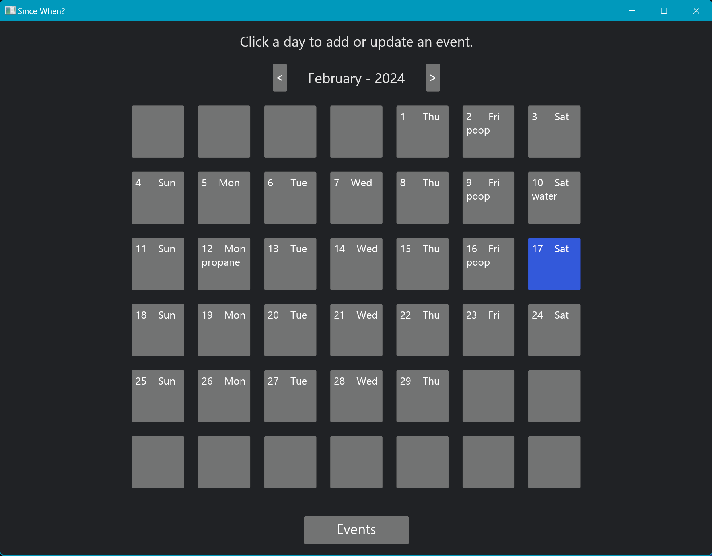

# Since When?

### A simple tool to track how long since something happened.

App opens to a list of events showing how long it's been since the last time an event occurred, and the average time between occurrences.

There are no popups asking to confirm updates and deletes. Deleting an event deletes all occurrences. If an event is misspelled, just delete and re-add.

Windows and Linux versions are available.

Click a day on the calendar to add a new event.

Add, Update, or Delete events from the list.

